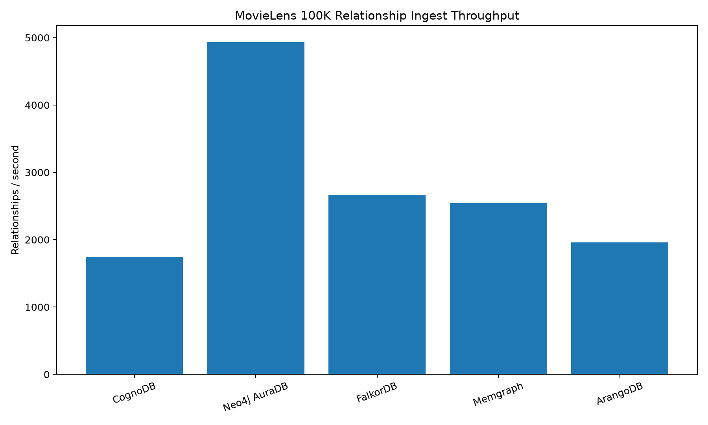
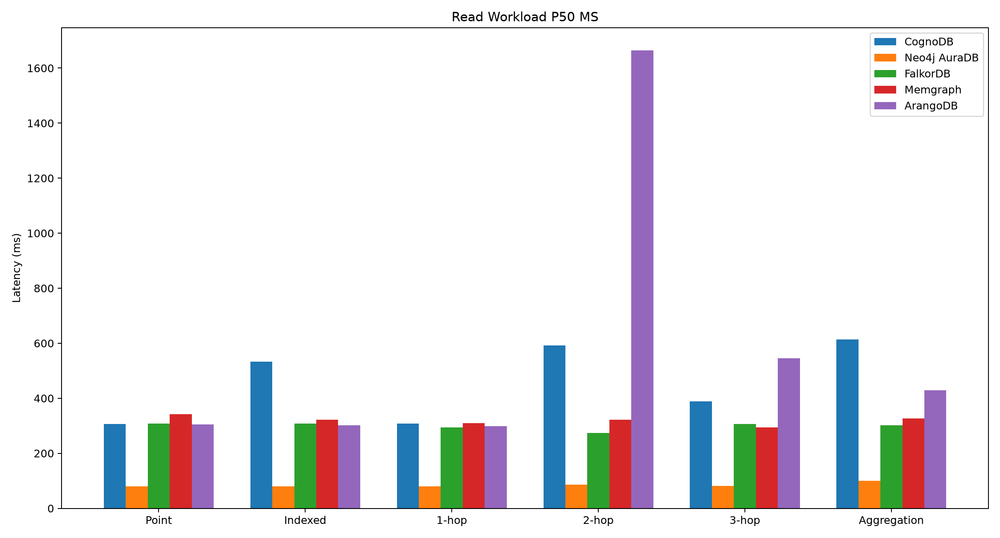
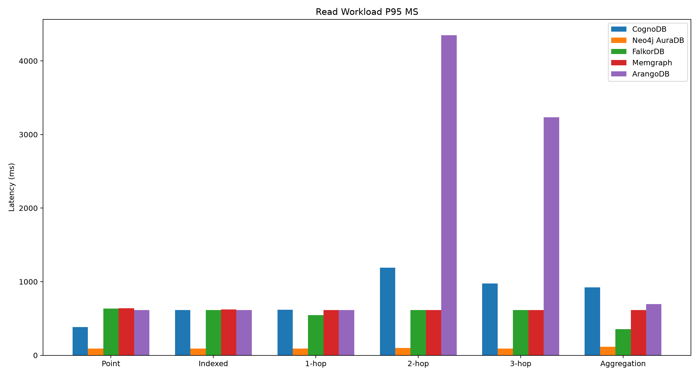
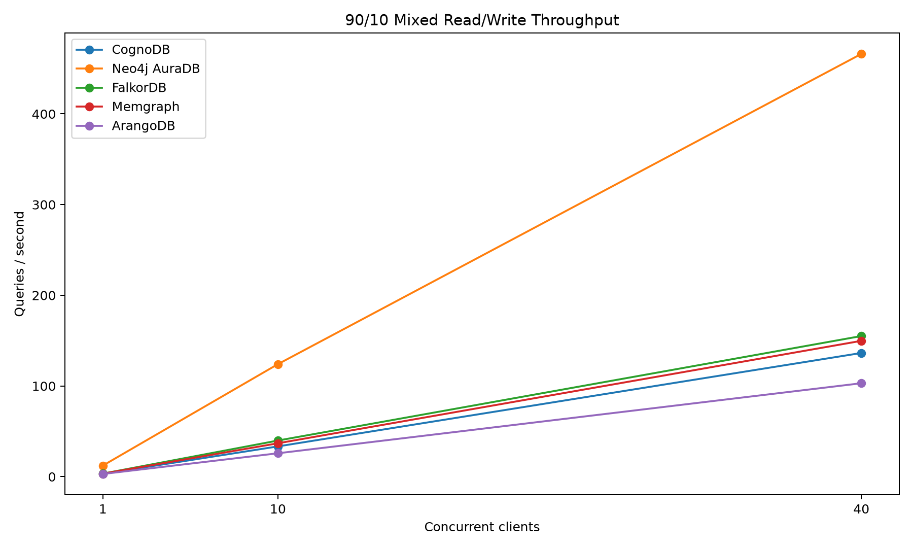
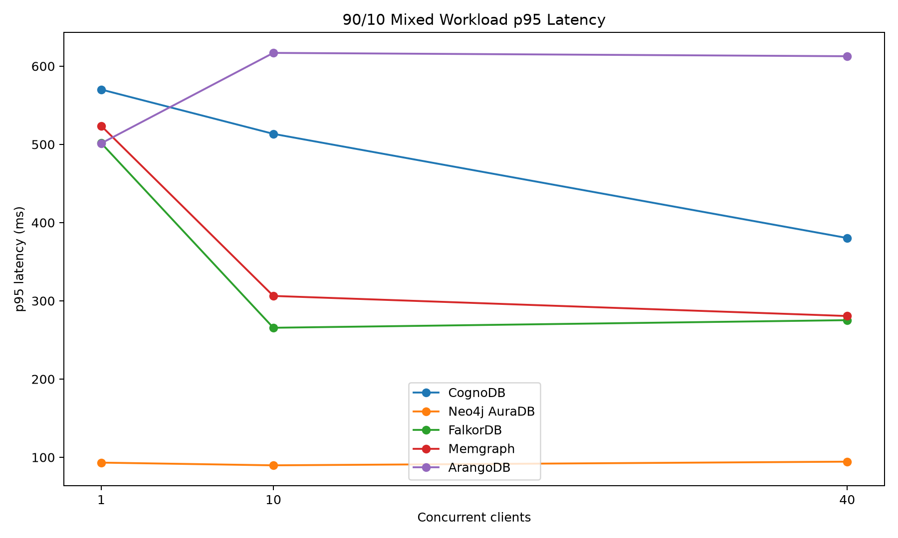

# Managed Graph Database Cloud Benchmark

**CognoDB vs Neo4j AuraDB vs FalkorDB vs Memgraph vs ArangoDB**

> A reproducible benchmark of five managed graph database configurations using one canonical dataset, deterministic query inputs, client-observed latency, percentile reporting, and explicit fairness caveats.

---

## TL;DR

Five graph database services were benchmarked using the same **MovieLens 100K** graph:

- **943 User nodes**
- **1,682 Movie nodes**
- **2,625 total nodes**
- **100,000 `RATED` relationships**

Every final ingest run verified the expected graph counts before its measurements were accepted.

Read workloads used:

- 20 warm-up executions
- 120 measured executions
- deterministic seed `20260816`
- identical start-node IDs
- identical lookup values
- identical target movie IDs

Mixed read/write tests used:

- **90% reads / 10% writes**
- concurrency **1 / 10 / 40**
- 5-second warm-up
- 20-second measured interval

**Important:** this is a managed free/trial-tier comparison, not a strict hardware-normalized engine benchmark. Resource allocations and regions were not identical across providers.

---

## Why this benchmark exists

Graph database benchmarks are easy to make misleading.

Changing datasets, query inputs, indexes, warm-up policy, regions or client behavior can make a database appear faster without actually demonstrating a meaningful architectural advantage.

This project therefore focuses on:

1. **reproducibility**
2. **same logical workloads**
3. **deterministic inputs**
4. **percentile latency instead of averages alone**
5. **raw result preservation**
6. **explicit disclosure of resource and region mismatches**

---

## Platforms

| Platform | Configuration used | Observed resources | Region | Query interface |
|---|---|---|---|---|
| CognoDB | Free c0 | 512 MB RAM, burst to 0.5 vCPU, 1 GiB storage | N. Virginia / us-east4 | Cypher / Bolt |
| Neo4j AuraDB | Free | RAM/vCPU not exposed | Not captured | Cypher / Bolt |
| FalkorDB | Free | 100 MB RAM | AWS us-east-1 | Cypher / FalkorDB client |
| Memgraph | 14-day Cloud trial | 2 GB RAM, 2 CPU | Not captured | Cypher / Bolt |
| ArangoDB | 14-day managed trial | RAM/vCPU not exposed | GCP Iowa | AQL / HTTPS |

See [`docs/fairness.md`](docs/fairness.md) for the full resource-parity discussion.

---

## Dataset

The benchmark uses the public **MovieLens 100K** dataset.

Canonical graph model:

```text
(User)-[:RATED {rating, timestamp}]->(Movie)
```

The upstream dataset is downloaded by script rather than redistributed inside this repository.

After download, the source is normalized once into:

```text
data/processed/users.csv
data/processed/movies.csv
data/processed/ratings.csv
data/processed/manifest.json
```

The processed files are SHA-256 fingerprinted so that every database can be shown to consume the same canonical input.

---

## Benchmark workloads

### Read workloads

| Workload | Logical operation |
|---|---|
| Point lookup | Fetch one user by ID |
| Indexed lookup | Filter/count movies by indexed release year |
| 1-hop | User → rated movies |
| 2-hop | User → movie ← other users |
| 3-hop | User → movie ← user → deterministic target movie |
| Aggregation | Group/count `RATED` relationships by rating value |

### Mixed workload

The mixed workload uses approximately:

```text
90% reads
10% writes
```

with client concurrency:

```text
1 → 10 → 40
```

Temporary benchmark-write records are removed between phases.

---

# Results

## 1. Relationship ingest throughput

| Platform | Nodes/s | Relationships/s | Relationship load | End-to-end |
|---|---:|---:|---:|---:|
| CognoDB | 1,216.6 | 1,740.7 | 57.447 s | 63.282 s |
| Neo4j AuraDB | 3,269.2 | 4,934.0 | 20.268 s | 21.660 s |
| FalkorDB | 1,086.9 | 2,666.4 | 37.504 s | 42.701 s |
| Memgraph | 1,035.6 | 2,546.6 | 39.268 s | 44.845 s |
| ArangoDB | 1,056.5 | 1,959.8 | 51.026 s | 71.319 s |



In this run, **Neo4j AuraDB recorded the highest relationship ingest throughput**. This is a managed-tier result and should not be treated as proof of an engine-only speed advantage because underlying resource allocations differ.

---

## 2. Read latency — p50

| Platform | Point | Indexed | 1-hop | 2-hop | 3-hop | Aggregation |
|---|---:|---:|---:|---:|---:|---:|
| CognoDB | 306.998 ms | 532.953 ms | 308.471 ms | 592.112 ms | 388.921 ms | 614.403 ms |
| Neo4j AuraDB | 79.618 ms | 79.392 ms | 79.724 ms | 85.396 ms | 81.843 ms | 100.862 ms |
| FalkorDB | 307.488 ms | 308.171 ms | 293.643 ms | 274.535 ms | 306.233 ms | 301.775 ms |
| Memgraph | 342.475 ms | 321.955 ms | 308.950 ms | 321.364 ms | 294.509 ms | 326.837 ms |
| ArangoDB | 304.518 ms | 302.443 ms | 298.557 ms | 1663.782 ms | 544.969 ms | 429.638 ms |



---

## 3. Read latency — p95

| Platform | Point | Indexed | 1-hop | 2-hop | 3-hop | Aggregation |
|---|---:|---:|---:|---:|---:|---:|
| CognoDB | 383.386 ms | 615.856 ms | 616.580 ms | 1189.455 ms | 976.476 ms | 920.949 ms |
| Neo4j AuraDB | 89.584 ms | 89.602 ms | 92.782 ms | 100.667 ms | 93.098 ms | 114.644 ms |
| FalkorDB | 633.059 ms | 615.256 ms | 547.334 ms | 614.962 ms | 614.574 ms | 356.453 ms |
| Memgraph | 639.254 ms | 622.396 ms | 615.521 ms | 615.778 ms | 615.605 ms | 614.997 ms |
| ArangoDB | 615.032 ms | 613.746 ms | 614.326 ms | 4347.129 ms | 3234.546 ms | 695.580 ms |



---

## 4. Mixed workload throughput

| Platform | C=1 | C=10 | C=40 |
|---|---:|---:|---:|
| CognoDB | 3.14 QPS | 33.41 QPS | 136.41 QPS |
| Neo4j AuraDB | 12.27 QPS | 124.10 QPS | 466.19 QPS |
| FalkorDB | 3.40 QPS | 39.86 QPS | 155.08 QPS |
| Memgraph | 3.31 QPS | 36.85 QPS | 149.80 QPS |
| ArangoDB | 3.00 QPS | 25.82 QPS | 103.04 QPS |



All 15 final concurrency points completed with **zero recorded query errors**.

---

## 5. Mixed workload p95 latency



---

## 6. Control-query latency

A trivial `RETURN 1` query was measured using the same 20 warm-up / 120 measured policy.

This is **not pure network RTT**, but it helps expose the baseline client-to-managed-service cost before graph work becomes significant.

| Platform | Control p50 | Control p95 |
|---|---:|---:|
| CognoDB | 289.187 ms | 614.049 ms |
| Neo4j AuraDB | 74.646 ms | 87.390 ms |
| FalkorDB | 253.554 ms | 556.694 ms |
| Memgraph | 263.045 ms | 613.748 ms |
| ArangoDB | 307.703 ms | 614.528 ms |

### Why this matters

Several simple graph workloads sit close to their platform's control latency floor.

For example:

- CognoDB control p50: **289.187 ms**
- CognoDB point lookup p50: **306.998 ms**

- Neo4j control p50: **74.646 ms**
- Neo4j point lookup p50: **79.618 ms**

That makes it unsafe to attribute the entire observed query latency to the graph engine itself.

The control value is therefore shown as context but **not subtracted** from workload latency.

---

## Key observations

### Neo4j AuraDB

Neo4j recorded the lowest client-observed latency across most workloads and the highest mixed-workload throughput in this particular run.

Its control-query latency was also dramatically lower than the other services, indicating that service/network path differences are likely a significant part of the observed advantage.

### CognoDB

CognoDB successfully loaded and queried the complete 100,000-edge graph on the small c0 free tier.

Its simple query latency was very close to its control-query latency, while deeper traversal workloads moved further above that floor.

An earlier exhaustive 3-hop pilot exceeded CognoDB's execution deadline. That result was retained rather than hidden; see [`docs/pilot_3hop_timeout.md`](docs/pilot_3hop_timeout.md).

### FalkorDB

FalkorDB completed the full dataset despite the free tier's much smaller 100 MB memory allocation and scaled strongly as concurrency increased.

### Memgraph

Memgraph also scaled strongly under the mixed workload, but its 2 GB / 2 CPU trial allocation is materially larger than CognoDB c0 and must be considered when interpreting the comparison.

### ArangoDB

ArangoDB's simple requests remained near its control latency floor, but its 2-hop and 3-hop traversal latencies increased substantially. ArangoDB used equivalent AQL rather than Cypher.

---

## Methodology

### Deterministic inputs

A fixed manifest is generated once:

```text
configs/read_manifest.json
```

It contains the warm-up and measured IDs/values used by every platform.

### Client-side timing

Latency is measured with:

```python
time.perf_counter_ns()
```

The timer surrounds the complete client request/response path, so the results intentionally represent **client-observed managed-service latency**.

### Warm-up

Every read workload receives 20 warm-up executions before 120 measured executions.

### Percentiles

The benchmark records:

- p50
- p95
- p99
- mean
- standard deviation
- minimum
- maximum

### Data integrity

Every ingest result is accepted only after verifying:

```text
943 User nodes
1,682 Movie nodes
2,625 total nodes
100,000 relationships
```

ArangoDB additionally checks edge endpoint integrity.

---

## Fairness and limitations

The largest limitation is **hardware/resource parity**.

Managed free and trial tiers did not expose equivalent RAM, CPU, storage or regions.

Therefore the results answer:

> **How did these actual managed free/trial configurations behave for this reproducible workload from this client?**

They do **not** answer:

> **Which underlying graph engine is universally fastest on identical hardware?**

Full discussion:

- [`docs/fairness.md`](docs/fairness.md)
- [`docs/analysis.md`](docs/analysis.md)
- [`docs/pilot_3hop_timeout.md`](docs/pilot_3hop_timeout.md)

---

## Reproducing the benchmark

### 1. Clone

```bash
git clone <repository-url>
cd cognodb-benchmark
```

### 2. Create Python environment

```bash
python3 -m venv .venv
source .venv/bin/activate
python -m pip install -r requirements.txt
```

### 3. Configure credentials

```bash
cp .env.example .env
```

Fill in your own service credentials.

**Never commit `.env`.**

### 4. Download dataset

```bash
./scripts/download_dataset.sh
```

### 5. Prepare canonical graph

```bash
python benchmark/prepare_dataset.py
```

Platform-specific loaders and workload runners live under `benchmark/`.

A single orchestration script is provided in `scripts/run_all.sh`.

---

## Repository layout

```text
benchmark/
  prepare_dataset.py
  load_cognodb.py
  load_neo4j.py
  load_falkordb.py
  load_memgraph.py
  load_arangodb.py
  run_*_reads.py
  run_*_mixed.py
  build_results.py
  build_analysis.py

configs/
  read_manifest.json
  platform_specs.json

docs/
  fairness.md
  analysis.md
  pilot_3hop_timeout.md

results/
  raw/
  summary_ingest.csv
  summary_reads.csv
  summary_mixed.csv
  SUMMARY.md

charts/
```

---

## Security

Credentials are read exclusively from environment variables.

The repository intentionally excludes:

- database passwords
- private connection credentials
- `.env`

Only `.env.example` is committed.

---

## Raw results

The final tables and charts are generated from the raw JSON outputs rather than manually transcribed benchmark values.

This makes it possible to audit the reported results and reduces the risk of documentation drift.

---

## Full analysis

See **[`docs/analysis.md`](docs/analysis.md)** for interpretation of the measurements and **[`docs/fairness.md`](docs/fairness.md)** for the benchmarking limitations.

---

## Author

**Damanjeet Singh**

Backend / AI / ML engineering

---

*Benchmark conducted on 16 August 2026.*
