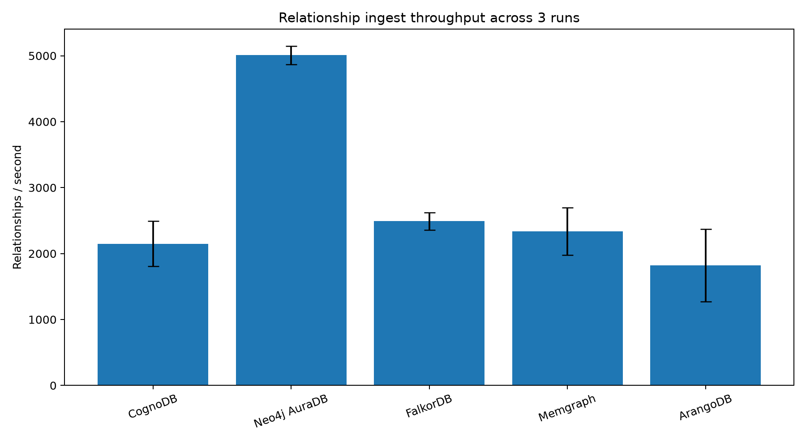
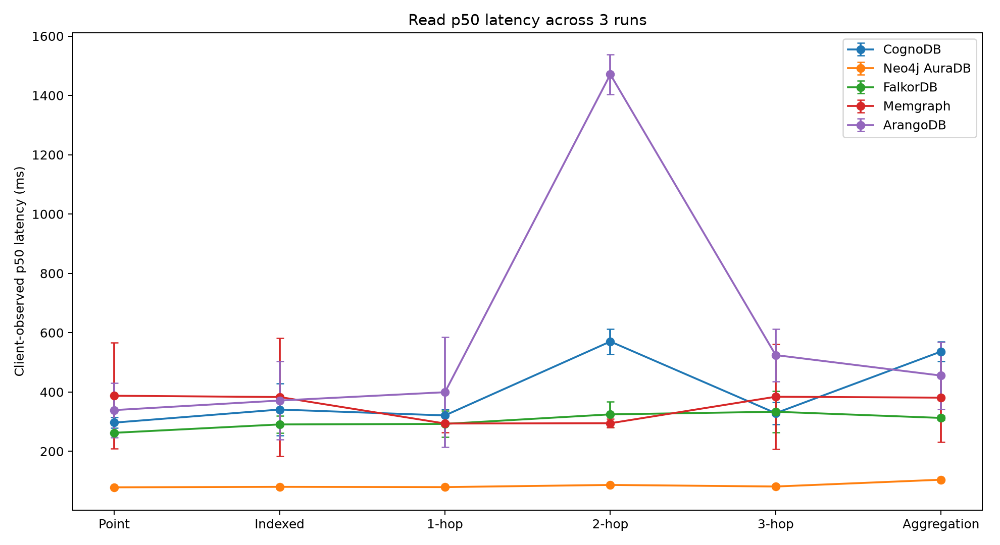
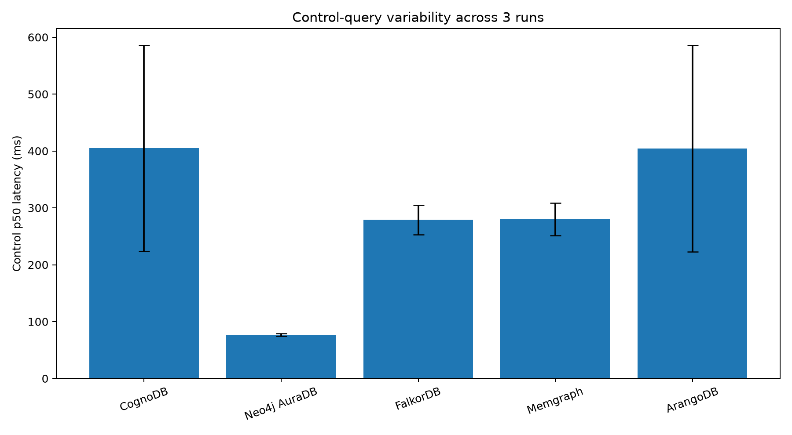

# Repeated Trial Analysis

This analysis aggregates **3 separate full benchmark executions**.

Values below are reported as **mean +/- sample standard deviation across runs**. This is separate from the within-run latency standard deviation already preserved in each raw JSON result. For latency percentiles, each repeated value is computed from the per-run percentile values; the 360 measured observations are not pooled into one percentile calculation.

The same canonical MovieLens 100K graph, deterministic read manifest, query definitions, client machine and benchmark harness were used for all archived runs.

## Relationship ingest throughput

| Platform | Relationships/s (mean +/- std) | Relationship load s (mean +/- std) |
|---|---:|---:|
| CognoDB | 2150.2 +/- 340.3 | 47.331 +/- 7.833 |
| Neo4j AuraDB | 5007.5 +/- 140.7 | 19.981 +/- 0.558 |
| FalkorDB | 2489.8 +/- 134.1 | 40.240 +/- 2.117 |
| Memgraph | 2336.9 +/- 360.1 | 43.544 +/- 7.331 |
| ArangoDB | 1820.9 +/- 550.1 | 58.839 +/- 19.689 |

## Read p50 latency

Detailed run-level p50/p95/p99 mean and standard-deviation values are in `repeated_summary_reads.csv`.

## Mixed workload at concurrency 40

| Platform | QPS (mean +/- std) | p95 ms (mean +/- std) | Errors across runs |
|---|---:|---:|---:|
| CognoDB | 114.39 +/- 25.61 | 526.399 +/- 144.973 | 0 |
| Neo4j AuraDB | 358.76 +/- 181.81 | 606.573 +/- 885.575 | 0 |
| FalkorDB | 133.50 +/- 36.79 | 392.558 +/- 195.862 | 0 |
| Memgraph | 121.57 +/- 24.36 | 508.146 +/- 189.995 | 0 |
| ArangoDB | 99.25 +/- 20.76 | 484.759 +/- 157.581 | 0 |

## Control-query variability

| Platform | Control p50 ms (mean +/- std) | Control p95 ms (mean +/- std) |
|---|---:|---:|
| CognoDB | 404.803 +/- 181.331 | 570.096 +/- 77.648 |
| Neo4j AuraDB | 77.092 +/- 2.326 | 88.536 +/- 3.468 |
| FalkorDB | 278.843 +/- 25.922 | 538.478 +/- 97.448 |
| Memgraph | 280.187 +/- 28.647 | 588.209 +/- 42.563 |
| ArangoDB | 404.263 +/- 181.570 | 502.105 +/- 126.338 |

## Interpretation

Run-to-run variance is expected in public managed services because network conditions, provider scheduling, throttling and shared infrastructure can change between executions. Reporting multiple separate executions therefore makes the comparison more defensible than relying on one production run alone.

These repeated measurements still do not turn the comparison into a hardware-normalized engine benchmark; the resource-parity caveats in `docs/fairness.md` continue to apply.

## Evidence layout

- `results/runs/run_01/` - archived raw JSON for run_01
- `results/runs/run_02/` - archived raw JSON for run_02
- `results/runs/run_03/` - archived raw JSON for run_03
